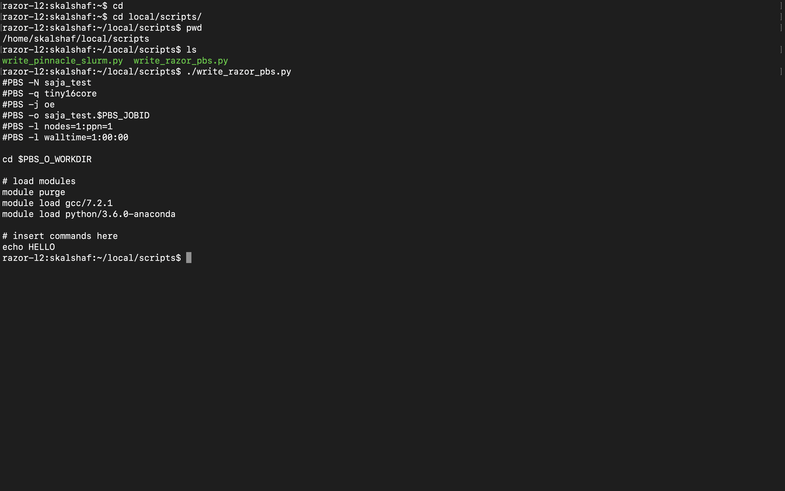

# BIOL5153
assn03.tgz: zipped tape archive of batch scripts and output files from BIOL assingment 3.

assign05: Adding nucleotide_composition.py that reads dna.txt and prints sequence length and nucleotide frequencies to the screen 
